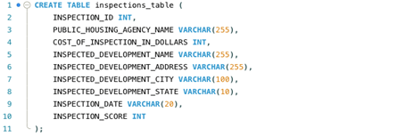
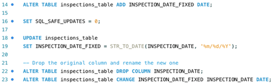
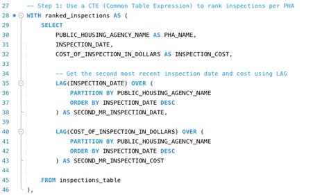
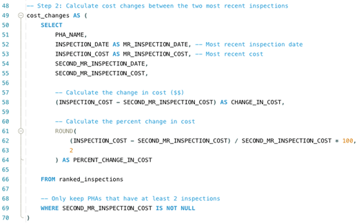
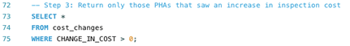
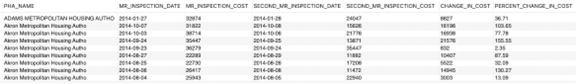

# S-Project 4: Public Housing Inspection Fact Modeling, Aggregation & SCD Type 2 Design (SQL + Data Warehousing)

This project analyzes a public housing inspection dataset and applies **fact/dimension identification**, **aggregated fact table design**, and **Slowly Changing Dimension (SCD) modeling**.  
It also includes business analysis requirements such as detecting cost increases using window functions (e.g., LAG).

* **Dataset:** Public Housing Inspection Data  
* **Tools:** SQL, Data Warehousing, Dimensional Modeling  
* **Techniques:** Fact identification, additive vs. non-additive facts, dimension modeling, aggregated fact tables, SCD Type 2, analytic reporting  
* **Goal:** Build a clean dimensional model and design an executive-level inspection cost analysis report.

---

# 🧱 1. Fact Identification

Based on the dataset, there are **2 measurable facts**:

| Fact Column                       | Description                           | Fact Type      |
|----------------------------------|---------------------------------------|----------------|
| COST_OF_INSPECTION_IN_DOLLARS   | Amount spent on each inspection       | **Additive**   |
| INSPECTION_SCORE                | Result/score of the inspection        | **Non-additive** |

These facts represent the core metrics used by leadership to evaluate housing inspections.  

---

# 🧱 2. Dimension Identification

There are **3 dimensions** in the dataset:

### 📌 **Dimension: Agency**
| Column                         | Description |
|-------------------------------|-------------|
| PUBLIC_HOUSING_AGENCY_NAME    | Housing agency managing the inspection |

### 📌 **Dimension: Development**
| Column                         | Description |
|-------------------------------|-------------|
| INSPECTED_DEVELOPMENT_NAME       | Name of the development |
| INSPECTED_DEVELOPMENT_ADDRESS    | Street address |
| INSPECTED_DEVELOPMENT_CITY       | City |
| INSPECTED_DEVELOPMENT_STATE      | State |

### 📌 **Dimension: Date**
| Column            | Description |
|------------------|-------------|
| INSPECTION_DATE  | When the inspection occurred |

Dimensions provide “who”, “where”, and “when” context for the facts.  

---

# ⭐ 3. Fact Table Design

Two fact tables were designed:  
✔ One **transactional fact table**  
✔ One **aggregated monthly summary fact table**

---

## 📌 **Transactional Fact Table — FactInspection**

| Column                           | Role            | Description |
|----------------------------------|----------------|-------------|
| INSPECTION_ID                    | PK             | Unique inspection ID |
| PUBLIC_HOUSING_AGENCY_NAME       | Dimension      | Agency inspected |
| INSPECTED_DEVELOPMENT_NAME       | Dimension      | Development inspected |
| INSPECTION_DATE                  | Date dimension | When inspection happened |
| COST_OF_INSPECTION_IN_DOLLARS   | Fact           | Cost of inspection |
| INSPECTION_SCORE                | Fact           | Score of inspection |

---

## 📌 **Aggregated Fact Table — FactMonthlyInspectionSummary**

Created because the original dataset does not contain monthly columns.

| Column                    | Description |
|---------------------------|-------------|
| YEAR_MONTH                | Year + month (YYYY-MM) |
| TOTAL_INSPECTION_COST     | Monthly total cost |
| AVG_INSPECTION_SCORE      | Monthly average score |
| NUMBER_OF_INSPECTION      | Monthly inspection count |

This allows leadership to view inspection performance at a higher, aggregated level.  

---

# 🔄 4. Slowly Changing Dimension (SCD) Strategy

The **Agency dimension** can change over time due to:

- Name changes  
- Address changes  
- Mergers or acquisitions  

To preserve historical accuracy, the best method is:

### ✅ **SCD Type 2 — Add a new row**

Why?

- Maintains accurate historical snapshots  
- Keeps original records intact  
- Tracks evolution of agency identity  
- Supports long-term trend analysis  

This ensures that reports always reflect agency details *as they existed at the time of each inspection*.  

---

# 📊 5. Executive Report Requirement — Cost Increase Analysis

Leadership wants:

> “For each Public Housing Agency, check if the **most recent inspection** cost increased compared to the **second-most recent inspection**.”

1.Create inspections_table.

  

2.Change the date format to match MySQL’s YYYY-MM-DD format, as our CSV uses MM/DD/YYYY. In MySQL Workbench Wizard, import INSPECTION_DATE as a VARCHAR(20) column. After importing the data, execute a query to convert the text to a DATE column.

  

3.Write SQL analysis using LAG().

  

  

  

The final report includes:

| Column Name                      | Description |
|----------------------------------|-------------|
| PHA_NAME                         | Agency name |
| MR_INSPECTION_DATE               | Most recent inspection date |
| MR_INSPECTION_COST               | Cost of most recent inspection |
| SECOND_MR_INSPECTION_DATE        | Second-most recent inspection date |
| SECOND_MR_INSPECTION_COST        | Cost of second-most recent inspection |
| CHANGE_IN_COST                   | Difference (MR − Second MR) |
| PERCENT_CHANGE_IN_COST           | Percentage change |

This analysis was designed using SQL window functions such as `LAG()` and proper date conversion to handle CSV imports.  
Screenshots of the SQL logic and final result can be inserted here:

  
  
<em>Final cost change report output.</em>

---

# 🧠 Key Skills Demonstrated

- Fact & dimension identification  
- Additive vs. non-additive fact classification  
- Transactional & aggregated fact table design  
- SCD Type 2 implementation strategy  
- Analytical reporting using window functions  
- Business interpretation of cost trends  
- Dimensional modeling & warehouse architecture  

